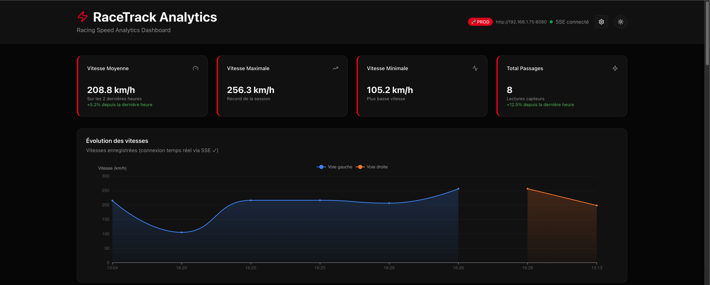
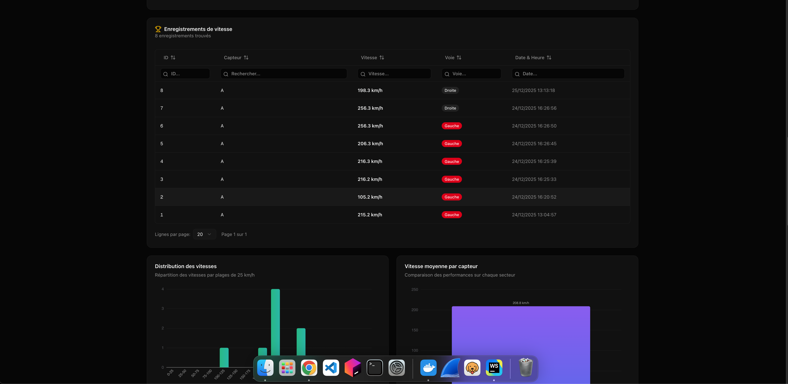
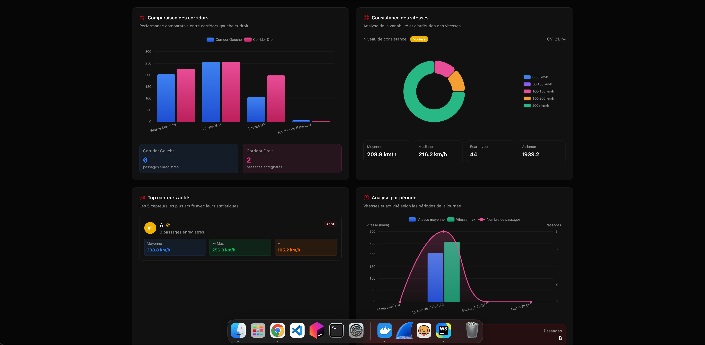
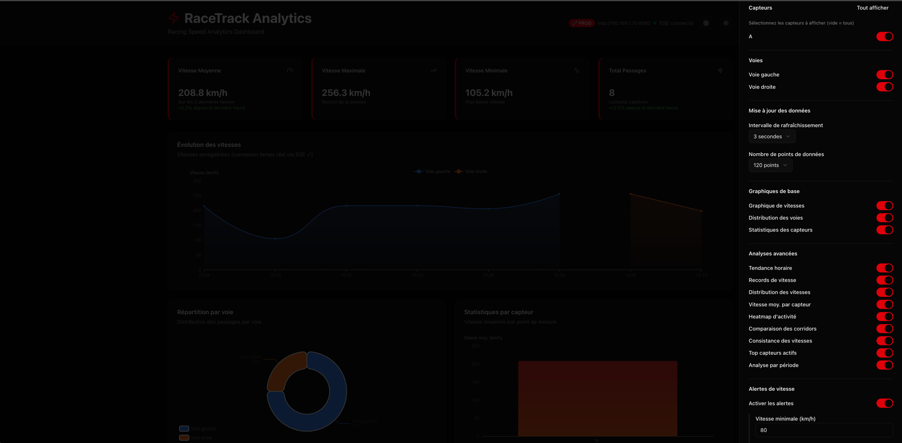

<div align="center">
    <h1>Race Board</h1>
</div>

<div align="center">
 
  
  
</div>

## 📖 Overview

Race Board is a monitoring application designed to visualize and analyze racetrack data. It provides a
user-friendly interface to track performance metrics, visualize data trends, and gain insights into
racing activities.

## ✨ Key Features

- ⚡ **Real-time Data Visualization**: Visualize data in real-time with interactive charts and
  graphs.
- 📊 **Performance Metrics**: Track key performance indicators such speed, average speed and lane
  usage.
- 📈 **Data Analysis**: Analyze trends and patterns

## 📋 Prerequisites

- **SpeedStream**: Race Board uses [SpeedStream](https://github.com/Maxime-Cllt/SpeedStream) for data
  streaming and processing. Ensure you have it set up in your project.

## 🚀 Getting Started

1**Build the Application in Release Mode**:

```bash
pnpm run dev
 ```

## 📸 Screenshots

<div align="center">

<table style="border-collapse: collapse; border: none;">
  <tr>
    <td></td>
    <td></td>
  </tr>
  <tr>
    <td></td>
    <td></td>
  </tr>
</table>

</div>

## 🔗 See Also

- [SpeedStream](https://github.com/Maxime-Cllt/SpeedStream)

## 🧪 Code Quality

### Unit Tests available

To run unit tests, use the following command:

```bash
pnpm run test
```

### Linting

To check for linting issues, run:

```bash
pnpm run lint
```

### Format Code

To format the codebase, use:

```bash
pnpm run format
```

## 🤝 Contributing

Contributions are welcome! To contribute:

- **Fork the Repository**
- **Create a Feature Branch**:
  ```bash
  git checkout -b feature/your-feature-name
    ```